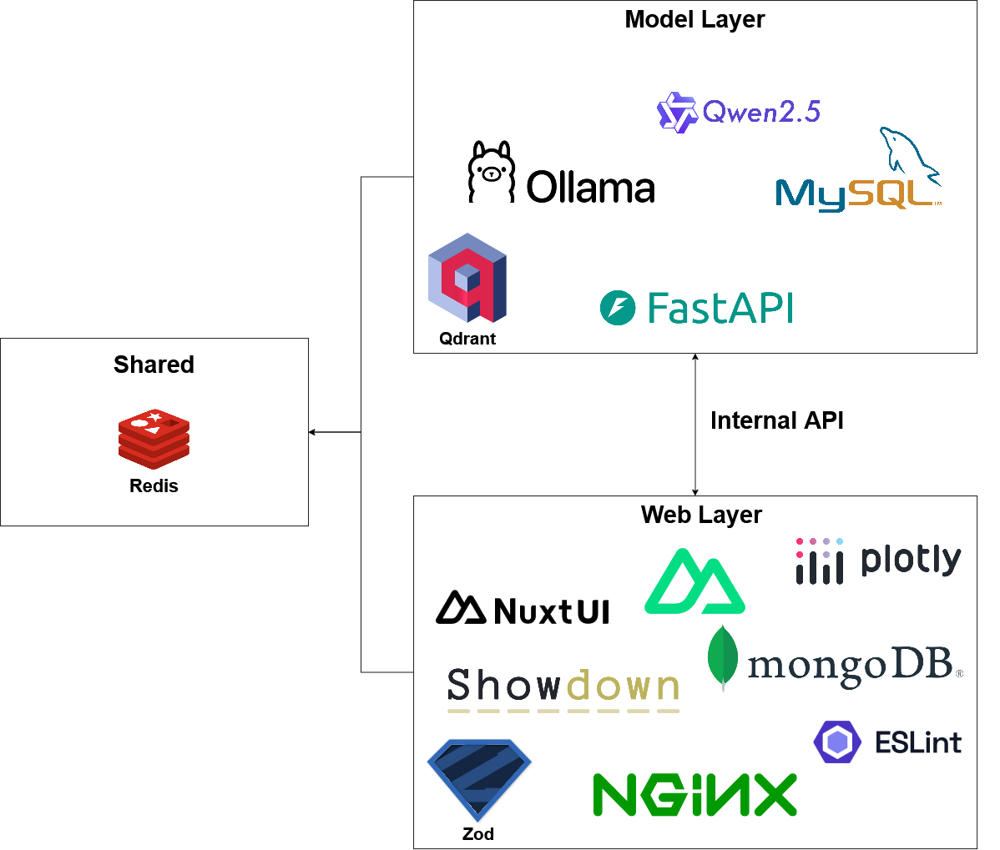
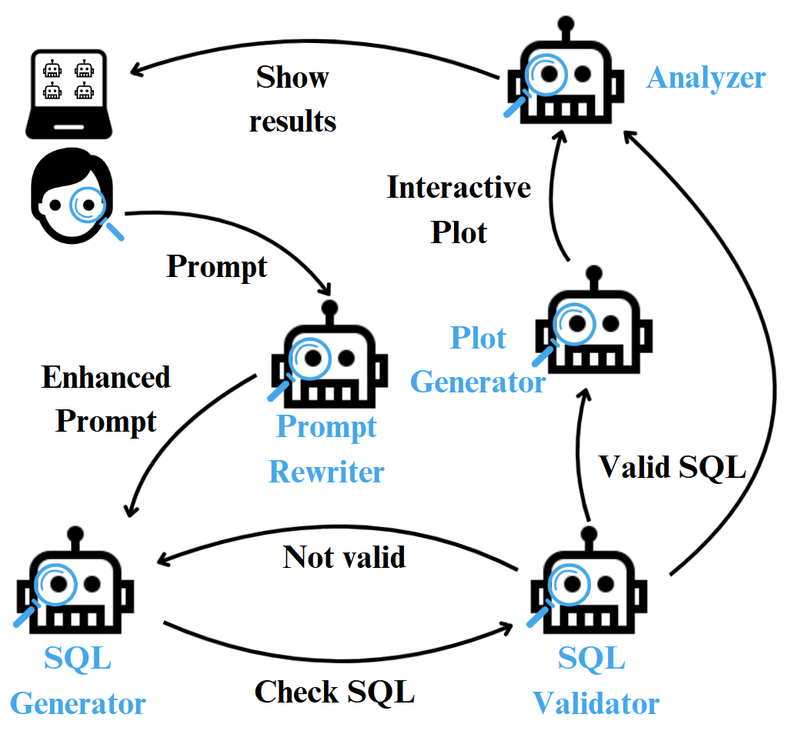

# Mostaelim

    

* **GP495/GP497** Project
* Contains 2 layers (different codebase):
    - [Web Layer](https://github.com/zRakan/GP495-Web/tree/98b69250da9c589c88fc09e723e23f2900c4ab04)
    - [Model Layer](https://github.com/zRakan/GP495-Model-API/tree/ffc6cc6af85b58b1bfa69dcd1f08f0c1e1072efd)

## System Architecture

## Agents Flow

## Credits
* zRakan - Rakan Almutairi
* itRayan - Rayan Alsahli
* SaadDevl - Saad Al Masaad
* Salehtwj - Saleh Altuwaijri
